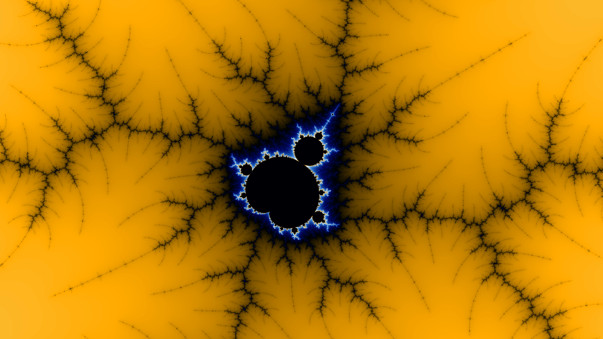
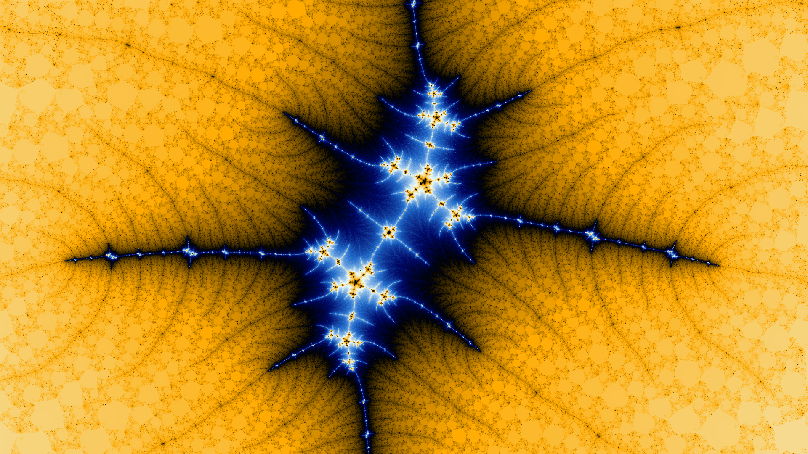

# Mandelbrot Explorer

An interactive Mandelbrot set explorer built with WebGL2 and React. Supports deep zoom with emulated double-precision arithmetic, smooth coloring, and a dynamic tile-based rendering system.

**[Try it live →](https://mandelbrot.musat.ai)**

## Screenshots

<table>
  <tr>
    <td></td>
    <td></td>
  </tr>
  <tr>
    <td></td>
    <td></td>
  </tr>
  <tr>
    <td></td>
    <td></td>
  </tr>
</table>

## Technical Overview

### Rendering

Tiles are rendered entirely on the GPU using **WebGL2 instanced draw calls**. Each frame, all missing tiles are submitted in a single `drawArraysInstanced` call, where the vertex shader positions each tile instance into a packed grid on an offscreen canvas. The CPU then splices individual tile images out of that grid and caches them.

### Precision

At zoom levels below 1×10⁷, coordinates are passed as standard `float`. Beyond that threshold the renderer switches to **emulated double precision** — each coordinate is split into a high and low `float` component (Veltkamp splitting), and all arithmetic in the fragment shader uses double-float (df_add, df_sub, df_mul) routines to recover the lost mantissa bits. This allows zoom depths up to ~1×10¹⁴ without visible rounding artifacts.

### Tiling & LOD

The world is subdivided into a quadtree of tiles at level `L`, where each tile covers a fractal region of size `2⁻ᴸ`. The renderer maintains a tile cache keyed by `(L, x, y)` and evicts tiles that are too distant or too deep relative to the current view. When a new tile is rendered, its pixel data is back-projected into any cached parent tiles to provide smooth LOD transitions while the full-resolution tile loads.

### Iteration Count

The iteration cap scales with zoom depth: `BASE_ITERS + L × ITERS_PER_LEVEL`, capped at `MAX_ITERS`. Coloring uses the smooth escape-time formula with a log₂ correction on the final orbit magnitude, mapped through a custom 5-stop palette.

### Adaptive Performance

A frame-time EMA tracks rendering cost. When intensive frames consistently run below 20 fps, `tilesPerFrame` is scaled down; above 45 fps it scales back up, keeping the renderer responsive across a wide range of hardware.

### Stack

- **React 19** — UI and event handling
- **WebGL2** — GPU rendering
- **TypeScript** — typed throughout
- **Vite** — build tooling
